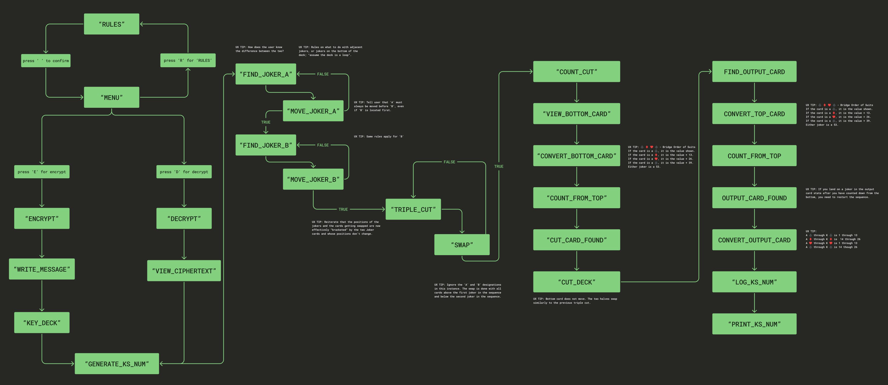
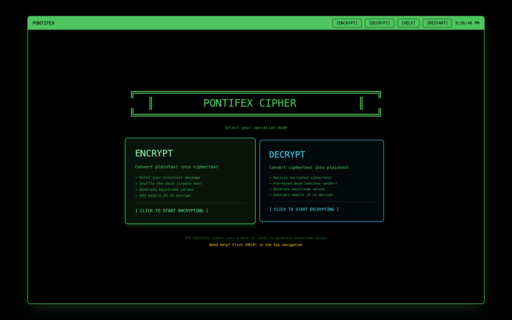
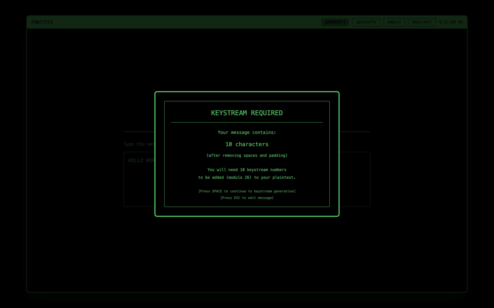
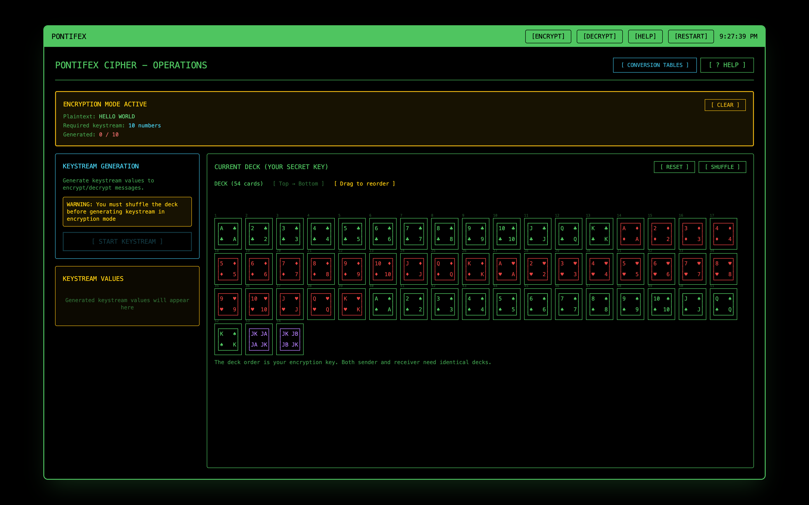
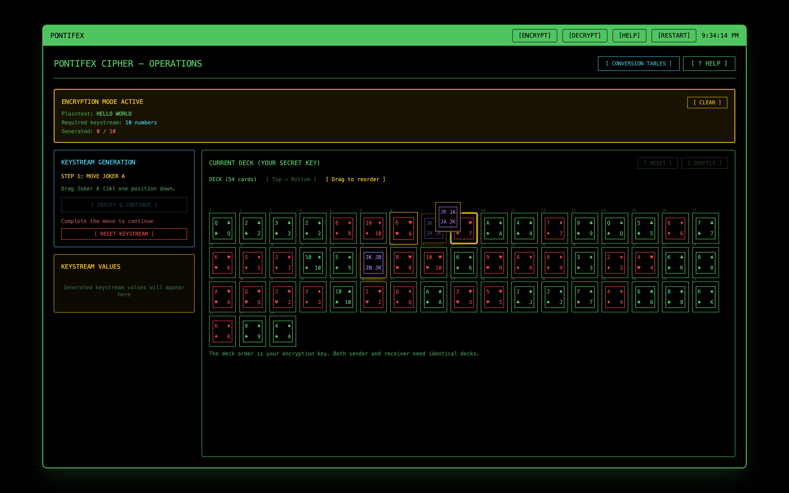
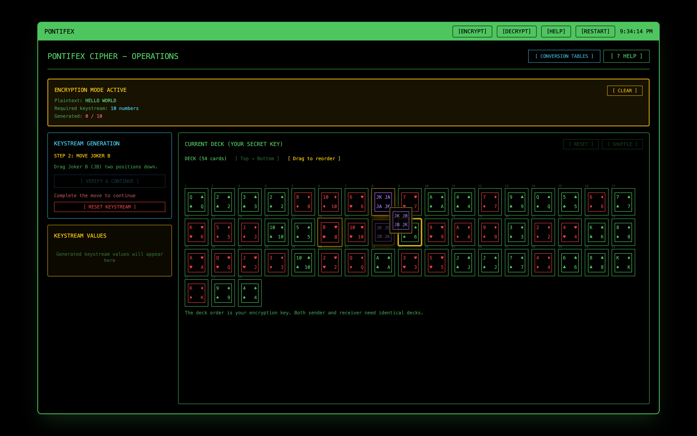
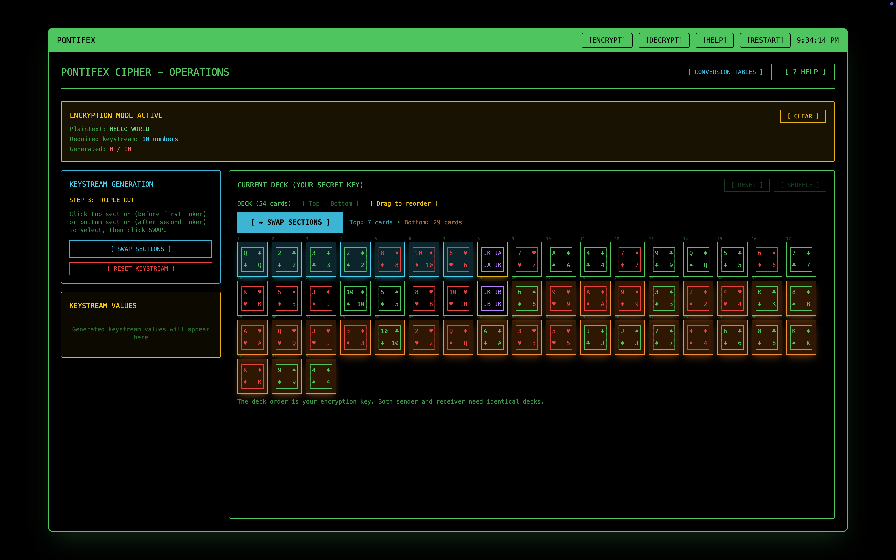
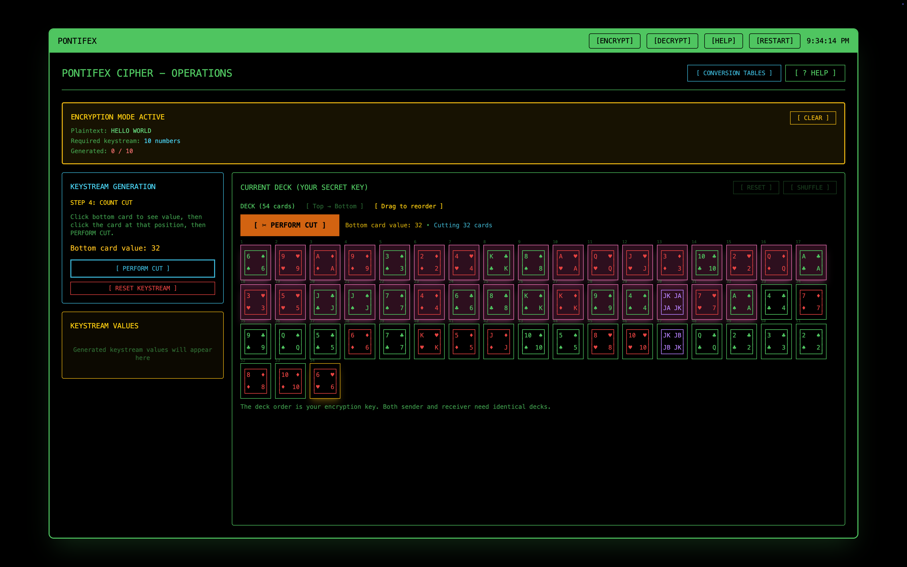
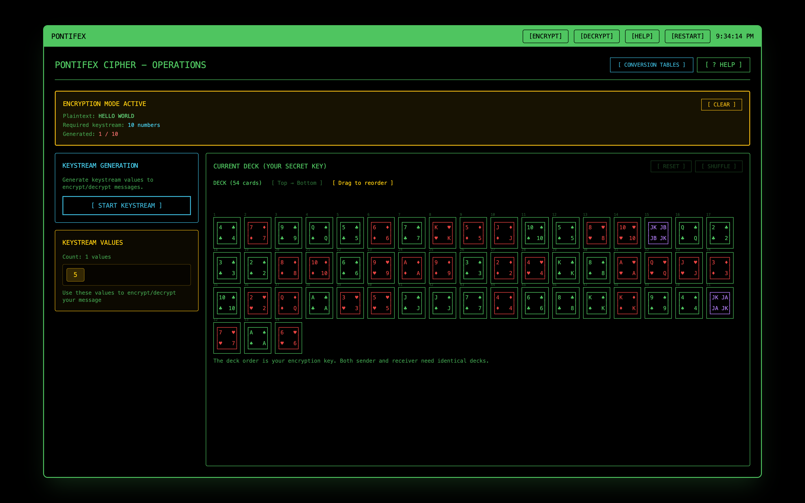
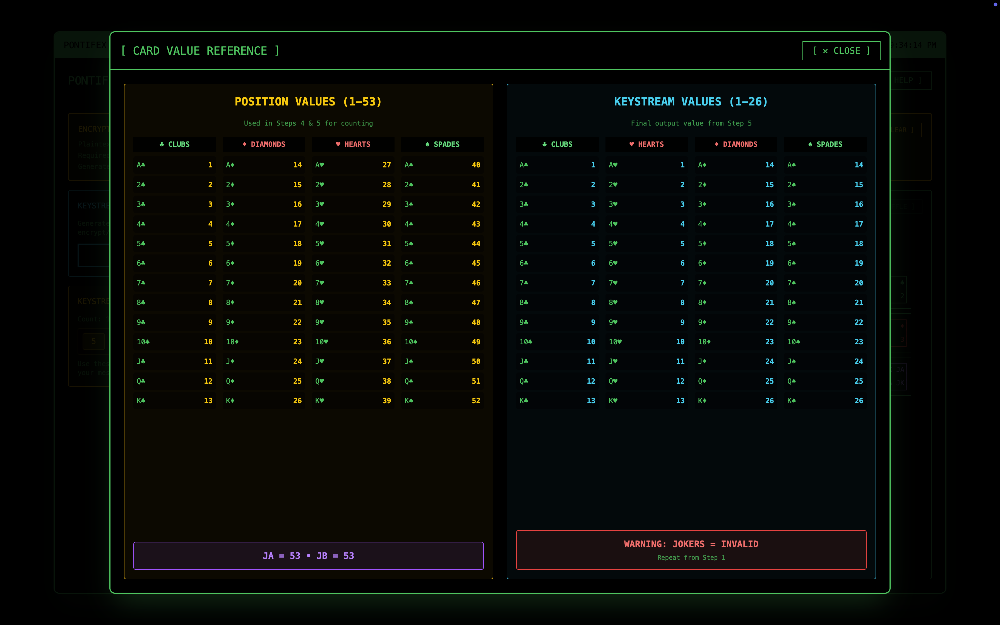

   

  # Pontifex

  This game and the guidelines which I used to generate my code were made possible thanks to: [Bruce Schneier](https://www.schneier.com/academic/solitaire/) and Neal Stephenson's [Cryptonomicon](https://en.wikipedia.org/wiki/Cryptonomicon). 
  
  It is a for-entertainment-purposes visualization of the pen-and-paper cipher-operation which allows Randy Waterhouse and [Enoch Root](https://www.cafeaulait.org/cryptonomicon.html) to communicate without being picked up by [Van Eck phreaking](https://en.wikipedia.org/wiki/Van_Eck_phreaking).

  You can play the game at: https://philcodee.github.io/hello-world/

  ## Project Goals

  The main goal of this project was to convert the **Solitaire Encryption Algorithm** into a working UI, with a particular focus on accurately depicting the Keystream Generation sequence.

  I was always interested in the Solitaire Algorithm in the back of Cryptonomicon, although I never tried to break it down and get a deep understanding of how it works.

  ## Technical Details

  This project was **vibe-coded** using Figma Make, Claude, ChatGPT, and p5.js. The [guidelines](guidelines.md) I used for Make were created on Claude using a combination of text which I transcribed directly from Cryptonomicon (pgs. 911-917), as well as trained on the text from Bruce Scheiner's website.
  
  Example prompts I used while adding `EncryptMode` and `DecryptMode`:
  
  * "When the user presses enter, a modal pops up and tells the user that the amount of characters typed requires that amount of keystream numbers which can be added modulo 26 to the plaintext the user wants to encrypt."

  * "For encrypt mode, when the correct amount of keystream numbers is generated, the user should be able to advance to the add modulo 26 component of the encryption sequence."

  * "Remove 'CIPHER OPERATIONS' and 'OUTPUT' boxes from this component. They are no longer necessary because now there is an encryption mode."

  * "In decrypt mode, the user should be receiving an encrypted message that they would be decrypting, so starting with a typing prompt is incorrect. I should be shown the encrypted message and proceed to generate keystream from an intialized deck. This also means the user would be shuffling the deck in this case, it would already be keyed by whoever encrypted the message."

  * "Decryption mode should have a pre-shuffled deck. Add a function which happens when user presses space or enter to continue. that should trigger a function on the decryption mode intro screen to simulate a prekeyed deck."

  ## Running the code

  ### Figma to GitHub Page

  #### In VS Code:
  * Open full `hello-world` folder
  * Add to `vite.config` to prepare for build
  
```
  export default defineConfig({
    base: '/hello-world/', <- add this line here so that GitHub can reference folder when building
    plugins: [react()],
    resolve: [],
  })
```

  * Don't forget to save file

#### In Terminal:

```
cd /Users/philcote/Documents/GitHub/hello-world

cd pontifex-v2

npm run build
```

#### In Finder:
* Drop assets, `index.html` into docs folder

#### GitHub Desktop:
* Commit changes

#### Troubleshooting:
* Open inspect and console log for bugs

## Process

**Approach and Workflow**<br/>I started by going through the steps as they were laid out and went ahead with transcribing documenting and starting to figure out how they would be broken up and understoood as different components. 

I was also eager to try out with a real deck of cards. I learned early on that the Solitaire I knew from Win95 was different than the program being employed by the cipher operation. Apart from the `encrypt` plaintext, `decrypt` ciphertext, `addModulo26`, `subtractModulo26`, and the conversion tables for ` ♣︎ , ♦︎ , ♥︎ , ♠︎ ` the most important for me to understand, was how the `keystream generator` process worked. I spent multiple hours trying to get the sequence right with the deck of cards until I'd really internalized the steps and could map it out as a state machine.



**Challenges faced and how solved**<br/> The biggest challenge was first, wrapping my head around how this would be visualized. I went in thinking I would be able to code from scratch, but soon accepted that if I was going to capture the overall experience of Pontifex...

**What Learned**<br/>It was very helpful to understand the mechanics of the algorithm before attempting to vibe code it. Having played it out by hand with a real deck allowed my to troubleshoot more accurately when output would not match my expectations... 

## Media


**Encrypt/Decrypt Menu**<br/>Once the user starts the program, they have two options, they can either encrypt a message or decrypt a message.


**Keystream Required**<br/>While in encrypt mode, the user is told that the plaintext message (in this case containing 10 characters) will require them to generate 10 keystream numbers.

**Start Keystream Generator**<br/>The first step in the keystream generation process is to shuffle the deck. For a real deck, Schneier suggests shuffling at least 10 times. The decrypter would need their deck to be identically sequenced for it to work.

**Move Joker A**<br/>Now that the deck has been shuffled, the user is prompted to move **Joker A** down one space. Think of each joker as a bracket around an array.

**Move Joker B**<br/>Once user verifies, they are then prompted to move **Joker B** down two spaces. Now that the "brackets" have been set, the user is ready to move on to the **Triple Cut**.

**Perform a Triple Cut**<br/>The user is now asked to click the top section before the first joker and the bottom section after the second joker, temporarily ignoring the **A** and **B** designations. The user clicks swap and proceeds to the **Count Cut**.

**Perform a Count Cut**<br/>The next step, the user is asked to click the bottom card to see the value. This number determines how many cards they count down the sequence. Once that position is clicked, the cards above and the cards below (excluding the bottom card) swap.

**Keystream Number Generated**<br/>In the final step, the user is asked to look at the top card, convert it, and count down the deck to the card in that number position. This card is called the **Output Card** and once clicked, the program displays the number as the first keystream value.

**Conversion Tables**<br/>During the keystream generation flow, the user can click on the 'Conversion Tables' button to access the card values to be used during both the cut sequences and the output card sequence.

## Reflection

* **What worked well?**<br/>The card deck and animations clearly depict the keystream number generation process.

* **What would you improve given more time?**<br/>I would continue to build on character development, refine UI, and fix some minor bugs

* **What would you do differently?**<br/>Trying different vibe-coding tools to see how results would vary. Look more into character development, bring more aspects of the book to the gameplay.