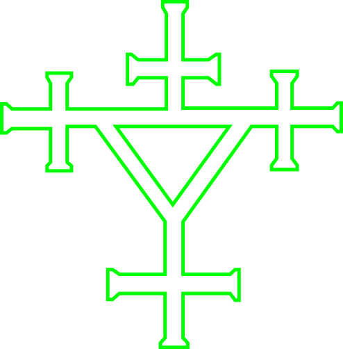

   

  # Pontifex

  This game and the guidelines which I used to generate my code were made possible thanks to: [Bruce Schneier](https://www.schneier.com/academic/solitaire/) and Neal Stephenson's [Cryptonomicon](https://en.wikipedia.org/wiki/Cryptonomicon). 
  
  It is a for-entertainment-purposes visualization of the pen-and-paper cipher-operation which allows Randy Waterhouse and [Enoch Root](https://www.cafeaulait.org/cryptonomicon.html) to communicate to avoid risking computers being picked up by hidden devices capable of [Van Eck phreaking](https://en.wikipedia.org/wiki/Van_Eck_phreaking).

  ## Running the code

  Run `npm i` to install the dependencies.

  Run `npm run dev` to start the development server.

  
  ### Figma to GitHub Page

  #### In VS Code:
  * Open full `hello-world` folder
  * Add to `vite.config` to prepare for build
  
```
  export default defineConfig({
    base: '/hello-world/', <- add this line here so that GitHub can reference folder when building
    plugins: [react()],
    resolve: [],
  })
```

  * Don't forget to save file

#### In Terminal:

```
cd /Users/philcote/Documents/GitHub/hello-world

cd pontifex-v2

npm run build
```

#### In Finder:
* Drop assets, `index.html` into docs folder

#### GitHub Desktop:
* Commit changes

#### Troubleshooting:
* Open inspect and console log for bugs

## Progress Report - 12/01/25

  ### What features did you complete?
  
  * `EncryptMode` Text based UI component created. User can write a message, then the program recognizes how many characters there are required to be generated in the keystream. Once necessary amount of keystream numbers generated, user is navigated to 'Add Modulo 26' flow. They can either go through this flow manually or can press auto-play to watch it played back.  
  
  * `DecryptMode` Text based UI component created functionality added to pre-key deck when decrypt mode starts so that the user can't shuffle the deck (wouldn't be able to since they would be receiving a keyed deck already)

  ### What bugs did you fix?

  * There were small functionalities like multiple places to generate a keystream which needed to be removed

  * Removed unecessary placeholder UI elements which had been generated by AI without specific prompting

  ### What compromises did you make?

  * The flows aren't perfect yet, there are still little UI bugs which I'm not worrying about at the moment to instead capture the overall flow

  * Currently, the encrypt mode cannot send the encrypted message to be decrypted, each of the flows us being used to illustrate the overall concept

  ### What still needs work?

  * Overall, another pass of removing unecessary UI elements generated as vibe coding byproduct.

## Project History - 12/04/25

### Inital Idea

I was always interested in the Solitaire Algorithm in the back of Cryptonomicon, although I never tried to break it down and get a deep understanding of how it works. I started by going through the steps as they were laid out and went ahead with transcribing documenting and starting to figure out how they would be broken up and understoood as different components. I was also eager to try out with a real deck of cards.

It leaned early on that the Solitaire I knew from Win95 was different than the program being employed by the cipher operation. Apart from the `encrypt` plaintext, `decrypt` ciphertext, `addModulo26`, `subtractModulo26`, and the conversion tables for ` ♣︎ , ♦︎ , ♥︎ , ♠︎ ` the most important for me to understand, was how the `keystream generator` process worked. I spent multiple hours trying to get the sequence right with the deck of cards until I'd really internalized the steps and could map it out as a state machine.